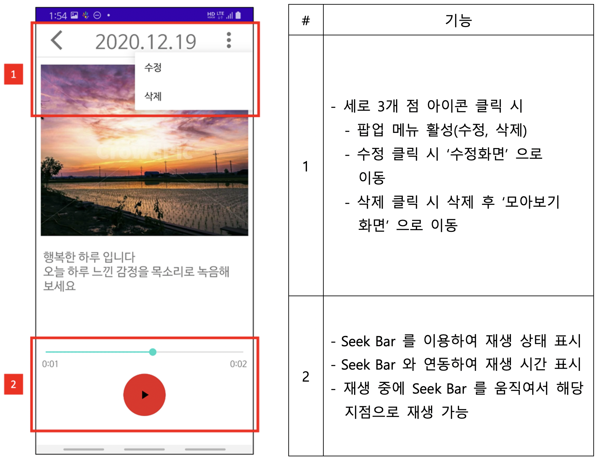

# AudioDiary (안드로이드 음성일기 앱)

## 1. 소개
로컬 데이터베이스를 이용하여 CRUD 환경이 갖추어진 일기 안드로이드 어플리케이션이다. 본 앱은 일기 데이터에 사진과 음성 녹음 기능을 포함한다.

 

## 2. 프로젝트 구현 환경
* **Language**           :	JAVA 11.0.9
* **IDE**                :	안드로이드 스튜디오 4.1.1
* **Minimum SDK**        :	API 26 Android 8.0 (Oreo)

 

## 3. 프로젝트 테스트 환경
* **Test SDK** : API 29 Android 10.0 (Q)
* 안드로이드 스튜디오에서 제공하는 에뮬레이터를 사용하였을 때는 외부 저장소(사진과 녹음 파일 저장) 이용이 원활하지 않아 제대로 테스트 할 수 없었다.
* 가급적이면 개인 단말기를 사용하여 테스트 할 것을 권장한다.

 

## 4. 화면 상세 (인터페이스) & 기능 설명

### 1. 메인화면

 

### 2. 일기 생성 & 수정 화면

 

### 3. 일기 모아보기 (간략히 보기)

 

### 4. 일기 보기 (상세 화면)

 

### 5. 일기 검색

 

## 5. 데이터베이스 스키마

CREATE TABLE **DIARY** (
  　　　　　**_ID** INTEGER PRIMARY KEY AUTOINCREMENT,
  　　　　　**DATE** TEXT,
  　　　　　**CONTENTS** TEXT,
  　　　　　**PHOTO_PATH** TEXT,
  　　　　　**RECODE_PATH** TEXT );

 

1. **_ID** : 일기의 고유 번호, 기본키로 정의하며 일기가 생성 시 자동으로
숫자가 1씩 증가
2. **DATE** : 일기의 날짜, 2020-12-02 형태로 저장
3. **CONTENTS** : 일기의 내용, 텍스트로 저장
4. **PHOTO_PATH** : 일기의 사진을 내장 메모리(외부 저장소)에 저장
하고 경로를 DB에 저장하여 사진에 접근
해당 경로는 다음과 같다. “/storage/emulated/0/Mydiary/picture/파일명.jpeg”
5. **RECODE_PATH** : 일기의 녹음 파일을 내장 메모리(외부 저장소)에 저장하고 경로를 DB에 저장하여 녹음 파일에 접근
 해당 경로는 다음과 같다. “/storage/emulated/0/Mydiary/recode/파일명.mp3”

